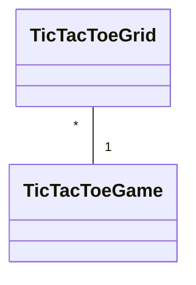

# Arkkitehtuurikuvaus

## Rakenne
Sovelluksessa on seuraavat hakemistot: 
- ui, joka sisältää käyttöliittymästä vastaavan koodin
- services, joka sisältää sovelluslogiikasta vastaavan koodin
- repositories, joka sisältää sovelluksen käyttäjien tietojen tallennuksesta vastaavan koodin

## Käyttöliittymä
Sovelluksessa on kolme näkymää: yksi kirjautumiselle, yksi uuden käyttäjän rekisteröitymiselle, ja yksi ristinollan pelaamiselle.

## Sovelluslogiikka

Sovelluksessa on kaksi luokkaa ristinolla-pelin pelaamista varten.

## Tietojen pysyväistallennus
Sovelluksen käyttäjien tiedot tallennetaan SQLite-tietokantaan.
